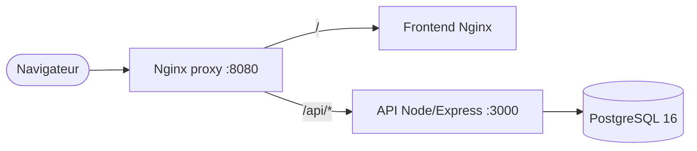

# ShopLite — chaîne DevOps complète

[](https://github.com/Tlassalle0/TP_CI/actions/workflows/ci.yml)
[](https://github.com/Tlassalle0/TP_CI/actions/workflows/cd.yml)


Mini application e-commerce (API Node/Express + frontend statique + PostgreSQL)
industrialisée pour le TP final DevOps : Git, Docker, Compose, CI/CD, observabilité,
sécurité, backup et **rollback sans perte de données**.

## Architecture



Détails : [`docs/ARCHITECTURE.md`](docs/ARCHITECTURE.md).

## Prérequis

- Docker + Docker Compose v2
- (hors Docker) Node.js 18 ou 20

## Démarrage rapide

```bash
cp .env.example .env          # ajuster les valeurs si besoin
docker compose up -d --build
```

Application : <http://localhost:8080>

```bash
curl http://localhost:8080/api/health
curl http://localhost:8080/api/ready
curl http://localhost:8080/api/products
```

Arrêt **sans** supprimer les données :

```bash
docker compose down           # ⚠️ ne JAMAIS utiliser `down -v` (supprime le volume)
```

## Développement de l'API hors Docker

```bash
cd api
npm install
npm test            # tests + couverture (échoue sous 80 %)
npm run lint        # ESLint
npm run format:check
npm start
```

## Environnements

| Env       | Lancement                                                                 | URL locale            |
| --------- | ------------------------------------------------------------------------- | --------------------- |
| dev       | `docker compose up -d`                                                     | <http://localhost:8080> |
| staging   | `docker compose -p shoplite_staging -f docker-compose.yml -f docker-compose.staging.yml up -d` | <http://localhost:8081> |
| prod (simulée) | `APP_VERSION=v1.0.0 HTTP_PORT=8082 docker compose up -d`              | <http://localhost:8082> |

Les environnements GitHub (`staging`, `production`) portent les secrets et la
validation manuelle (required reviewers) pour la prod. Voir [`CONTRIBUTING.md`](CONTRIBUTING.md).

## CI/CD

- **CI** (`.github/workflows/ci.yml`) : lint + format, tests (matrice Node 18/20 avec
  service PostgreSQL, cache npm, couverture en artefact), build Docker, scan Trivy + `npm audit`.
- **CD** (`.github/workflows/cd.yml`) : `develop` → staging, tag `v*` → production (validation manuelle).

## Tests, backup et rollback

```bash
./scripts/backup.sh           # dump horodaté dans backups/ (rétention 7)
./scripts/restore-test.sh     # restauration testée dans une base temporaire
./scripts/rollback.sh v1.0.0  # retour à une version stable, données conservées
BASE_URL=http://localhost:8080 ./scripts/smoke-test.sh
```

## Observabilité

- `/api/health` : état API + DB, version, uptime, timestamp.
- `/api/ready` : readiness (dépendances prêtes).
- Logs JSON structurés avec `request_id`, niveaux (`debug`→`fatal`) et masquage des secrets.
- Rotation des logs Docker (`json-file`, 10 Mo × 3).

### Tableau de suivi des incidents

| Symptôme | Heure | Cause | Commande utilisée | Résultat |
| -------- | ----- | ----- | ----------------- | -------- |
| `/api/products` renvoie 500 | 10:05 | colonne SQL inexistante introduite en v1.1.0 | `docker compose logs api` | erreur identifiée |
| Catalogue vide côté front | 10:08 | conséquence de l'erreur API | `curl /api/products` | 500 confirmé |
| — | 10:18 | rollback | `./scripts/rollback.sh v1.0.0` | service rétabli |

Détail complet : [`docs/INCIDENT.md`](docs/INCIDENT.md).

## Documentation

- [`CONTRIBUTING.md`](CONTRIBUTING.md) — stratégie Git, commits, PR
- [`CHANGELOG.md`](CHANGELOG.md) — historique des versions
- [`docs/ARCHITECTURE.md`](docs/ARCHITECTURE.md) — architecture détaillée
- [`docs/INCIDENT.md`](docs/INCIDENT.md) — rapport d'incident
- [`docs/DORA.md`](docs/DORA.md) — indicateurs DORA
- [`docs/RACI.md`](docs/RACI.md) — matrice RACI de l'équipe

## Sécurité

- Aucun secret réel dans le code, les images ou les logs (voir checklist `docs/INCIDENT.md`).
- `.env` ignoré par Git ; seul `.env.example` est commité.
- Scan d'image (Trivy) et audit des dépendances (`npm audit`) en CI.
- Conteneur API exécuté en utilisateur non-root (`USER node`).
