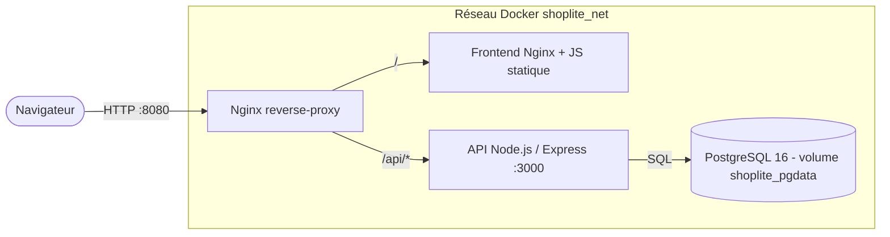
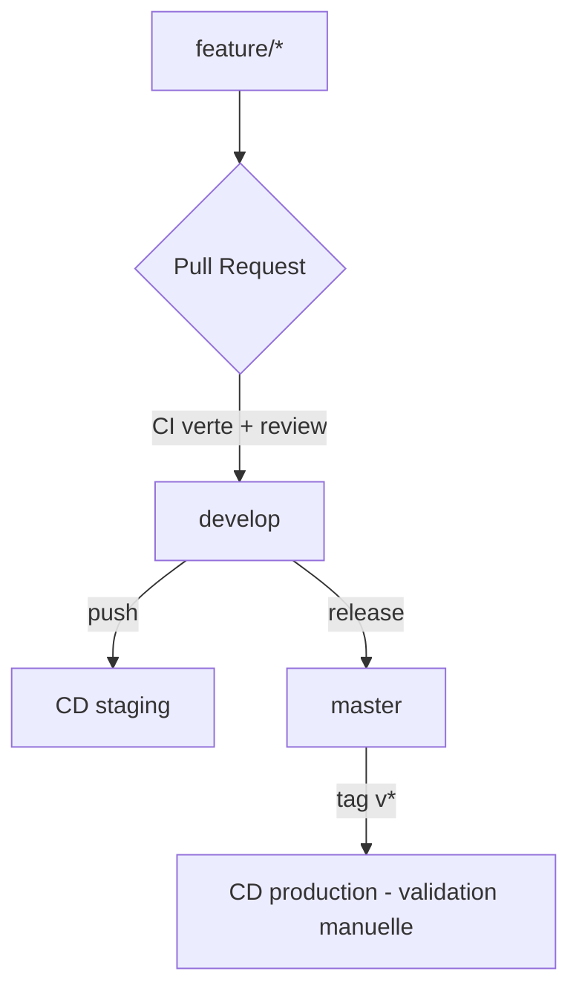

# Architecture — ShopLite

## Vue d'ensemble

## Composants

| Service    | Image / base        | Rôle                                       | Port interne |
| ---------- | ------------------- | ------------------------------------------ | ------------ |
| `proxy`    | `nginx:1.27-alpine` | Reverse proxy, point d'entrée unique       | 80 → 8080    |
| `frontend` | `nginx:1.27-alpine` | Sert l'interface statique (HTML/CSS/JS)    | 80           |
| `api`      | `node:20-alpine`    | API REST `/health`, `/ready`, `/products`  | 3000         |
| `db`       | `postgres:16-alpine`| Base de données, volume nommé persistant   | 5432         |

## Routage Nginx

- `GET /` → service `frontend`
- `GET /api/*` → service `api` (le préfixe `/api` est retiré : `/api/products` → `/products`)
- L'en-tête `X-Request-Id` est propagé jusqu'à l'API pour la traçabilité.

## Flux CI/CD

- **CI** : lint/format, tests (matrice Node 18/20 + PostgreSQL service), build Docker, scan Trivy + `npm audit`.
- **CD** : `develop` → staging (8081), tag `v*` → production simulée (validation manuelle via GitHub Environment).

## Persistance et rollback

- Les données vivent dans le volume nommé `shoplite_pgdata`, **découplé** du cycle de vie des conteneurs.
- Un rollback applicatif (`scripts/rollback.sh`) redéploie une version taguée stable
  **sans** toucher au volume. La commande `docker compose down -v` est interdite.
- Sauvegardes via `pg_dump` dans `backups/` (monté sur l'hôte), avec rétention.

## Environnements

| Env              | Réseau / projet    | Port HTTP | Base               |
| ---------------- | ------------------ | --------- | ------------------ |
| dev              | `tp_ci` (défaut)   | 8080      | `shoplite`         |
| staging          | `shoplite_staging` | 8081      | `shoplite_staging` |
| production (sim) | `shoplite_prod`    | 8082      | `shoplite`         |

L'isolation entre environnements repose sur le **nom de projet Compose** (`-p`),
qui préfixe conteneurs, réseaux et volumes.
